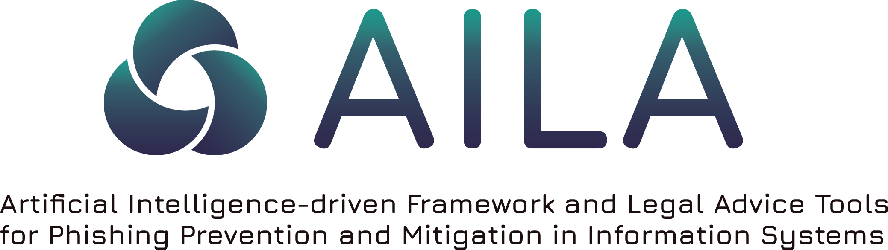

# AILA – Artificial Intelligence-driven Framework and Legal Advice Tools for Phishing Prevention and Mitigation in Information Systems

## Project Overview

This repository contains the official software of the AILA project. The software is a **chatbot-like application** specifically designed for lawyers, legal practitioners, and the general public, with a particular focus on cybersecurity and phishing in the European Union and Greece.  

The chatbot is capable of providing real-time answers in multiple languages, including English and Greek. It is based on a **Retrieval-Augmented Generation (RAG)** architecture, which integrates a legal information database with a retrieval mechanism that identifies and extracts relevant documents according to user queries. The retrieved information is then combined with a **Large Language Model (LLM)** to generate concise and contextually appropriate answers. This release represents a **beta version** of the software, which leaves room for future improvements and adaptations.

### Key Features
- Real-time interactive chatbot functionality.  
- Multilingual support in English and Greek.  
- Integration of legal and cybersecurity knowledge.  
- Emphasis on phishing prevention and mitigation.  
- Research-driven prototype currently available as a beta version.  

## Repository Contents
This GitHub repository includes both the **frontend** and **backend** components of the AILA Chatbot software:

- **Backend:** The backend is implemented using **FastAPI**. It manages user authentication, application connections, and the integration of the **Retrieval-Augmented Generation (RAG)** pipeline. It also handles user queries, generates appropriate answers, and manages the connection with the database.  
- **Frontend:** The frontend provides the user interface of the software, establishing the chatbot environment and managing the interaction with the backend. It is implemented in **TypeScript** with **Tailwind CSS** for styling and responsive design.

The documentation provided in this repository guides users through:  
- Installation and usage of the frontend.  
- Deployment and configuration of the backend.  
- Example queries and demonstration cases.  

---

## Installation
The software requires **Python 3.11 or higher**.  
It is recommended to install the application in a dedicated [Python virtual environment]([https://example.com](https://docs.python.org/3/library/venv.html). In addition, **[Docker](https://www.docker.com/)** must be installed on the system.  

### Steps for installation from source
```bash
# Clone the repository
git clone https://github.com/GiannisKat123/AILA-application
python backend/.py

cd AILA-application

```
Make sure you have also the suitable environment variables. You can find those in the settings file [here](https://github.com/GiannisKat123/AILA-application/blob/main/backend/database/config/config.py)

```bash
# Cache embedding and reranker models
python backend/cache_models.py
```

Suppose we want to run the software locally in the port 8080. You have to change base url in the frontend/api/axios.tsx to **'http://localhost:8080'**. This is were the backend listens as defined in the files.

Then you can do two things:

Either:

First change some configurations in the .env file:

```bash
# Environment variables
INIT_MODE = 'runtime'
VITE_API_URL="http://localhost:5173"
FRONTEND_URL="http://localhost:5173"

## port 5173 is the default port when launching a typescript project on dev mode
```

```bash
# Backend setup
cd backend
pip install -r requirements.txt
cd ..

uvicorn backend.main:app --reload --host 0.0.0.0 --port 8080
```

In a second terminal on the same path as the repository

```bash
# Frontend setup
cd frontend
npm install
npm run dev

click on the link provided
```

OR 

With two lines using the Dockerfile provided in repository by running
```bash
1) docker build -t demoapp .
2) docker run -it --rm `    
>>   -p 8080:8080 `
>>   -e INIT_MODE=runtime `
>>   -v "${PWD}\backend\cached_embedding_models:/app/backend/cached_embedding_models" `
>>   -v "${PWD}\backend\cached_reranker_models:/app/backend/cached_reranker_models" `
>>   --name aila-app demoapp
```

In this case make sure that the Frontend and Backend URLs are the same in the environmental variables file. For example: **'http://localhost:8080'**

## Usage
For more information about the functionalities of the software in the backend and frontend components, you can visit the docs [here](https://gianniskat123.github.io/AILA-application/)

## Acknowledgements
AILA stands for "Artificial Intelligence-driven Framework and Legal Advice Tools for Phishing Prevention and Mitigation in Information Systems", which is a research project financially supported by the Hellenic Foundation for Research and Innovation (H.F.R.I).

The project falls within the thematic area of “Social Sciences, Arts & Humanities, Management & Economic Innovation” and in the thematic field of “Development of Innovative Applications and Sustainable Business Models”, since the project revolve around the development of an innovative multidisciplinary framework that addresses phishing cyberattacks, providing groundbreaking opportunities to increase sustainability of business operations in several domains like e-banking, e-government, and e-education. The project is coordinated by the Department of Electrical and Computer Engineering of the University of Patras (Greece) with external collaborating partners the Law School of the Aristotle University of Thessaloniki (Greece).


